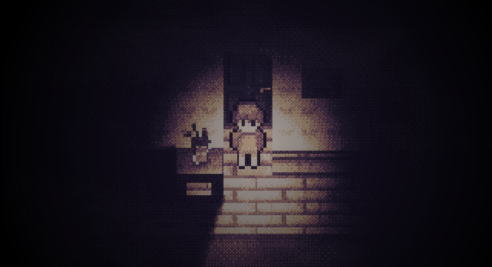

# Adrift in Darkness 🎴

made with ❤️ by wyernbw and Dey3000

 

## Download ⬇️
You can [download the game for free on itch.io](https://wyvernbw.itch.io/adrift-in-darkness)

## About
A 2D rpgmaker-like horror game inspired by games like 'The Witch's House' and 'Mad Father' made in a modern engine - Godot. You can find the source code to the game in this repository.

🦐 This game implements [grim](https://github.com/wyvernbw/grim) to create a dynamic experience. 

